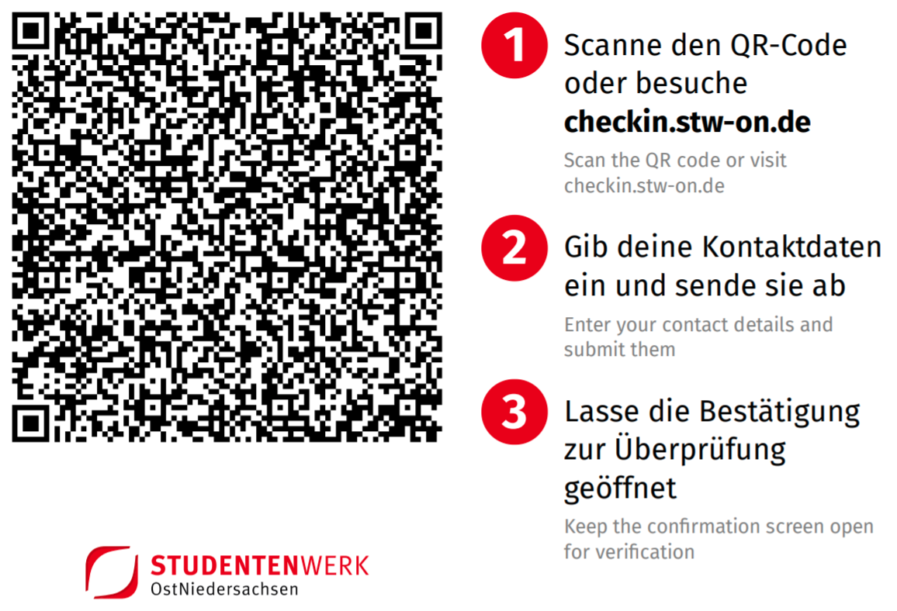

# Sheriff

Sheriff is a tool for easy and secure guest registration during the coronavirus pandemic.

  [](https://www.youtube.com/watch?v=dQw4w9WgXcQ)


## Features

- **Verification of EU Health Certificates**<br>
  You can set which certificates you want to allow for each facility individually
- **Asymmetric encryption after data validation**<br>
  The personal data is stored encrypted with a public key. The private key is not stored on the server and has to be entered when decryption is requested.
- **Progressive Web App: No app download or dedicated QR scanner app required**<br>
  Users don't need to download an app or have a dedicated QR scanner installed. The web app takes care of this and runs in all recent versions of major mobile browsers.
- **Cross registration with other organisations**<br>
  Users can use the registration website of one single organisation for other organisations as well, so they don't have to enter their data for each one. This needs to be enabled explicitly for each 3rd party organisation.
- **Automatic data deletion after 21 days**
- **Easy administration interface suitable for organisations with many locations**


## Demo




## Setup


### Prerequisites

- [Docker](https://docs.docker.com/engine/install/)
- [Docker Compose](https://docs.docker.com/compose/install/)
- public IP
- (sub)domain pointing to that IP


### Installation

1. Create a directory named `sheriff` somewhere on your server. We will use `/srv/sheriff` in this guide.
2. Copy `docker-compose.prod.yml` to `/srv/sheriff/docker-compose.yml`
3. Copy `.env.example` to `/srv/sheriff/.env`
4. Edit `/srv/sheriff/.env`:
    - Set `APP_KEY` to a random 32-char string (`pwgen -s 32 1`)
    - Set `SHERIFF_HOST` to the domain you want to use for Sheriff (e.g. `checkin.example.com`)
    - Set `LETSENCRYPT_EMAIL` to your email address. This is used for generating a Let's Encrypt HTTPS certificate
    - Set `DB_PASSWORD` to a random string (`pwgen -s 32 1`)
    - _(optional)_ Set `SHERIFF_EXTERNAL_ORIGINS` to a comma separated list of domains of 3rd party organisations you want to enable cross registration with. Note that you need to enable this on both instances for the other respectively.
5. Run `docker-compose up -d` to start the stack in background. Make sure your working directory is `/srv/sheriff`.
6. View the logs with `docker-compose logs -f`.
7. Visit your domain and verify you can access the site. It may take a while to generate the certificate.
8. Run `docker-compose exec app php artisan user:create` and create a user with all permissions.
9. Run `docker-compose exec app php artisan keypair:generate` and follow the steps to generate a key pair.<br>
   **IMPORTANT: Store the private key in multiple, physically separate safe locations (e.g. a text file on a USB flash drive). DO NOT store it on the server. You will NOT see it again after running the above command. You NEED this key to decrypt all saved data.**
10. Run `docker-compose exec app php artisan keypair:generate --sign` to generate a signing keypair. You don't need to save that one. You can generate new ones at any time.
11. Visit `<your domain>/admin`, log in and create a new location
12. Generate a QR code for the new location and try to register with your phone
13. Run `docker-compose exec app php artisan visits:export`, enter the key and verify that the data you just submitted with your phone is correctly exported.

If everything works as expected, you can start customizing your instance. **Remember to
modify the privacy policy accordingly!**


### Customizing

You can customize the user interface of your Sheriff instance using environment variables and mounted files.
Using ConfigMaps in Kubernetes is also possible.


#### Customizing the theme and logo

To customize the theme color and/or logo you can set the following environment variables in your `.env` file:

```dotenv
SHERIFF_THEME_COLOR=#2342de
SHERIFF_LOGO_URL=https://example.com/my-logo.svg
```

Apply the new Docker Compose config by running `docker-compose up -d`.


#### Customizing strings

1. Create a new file `strings.yml`
2. Insert your custom strings into that file. Take a look at [the bundled `strings.yml`](./ui/src/resources/strings.yml)
   for reference. You **do not** need to supply all strings in your custom file as it will be merged
   with the bundled one.
3. Mount your `strings.yml` to `/app/strings.yml`.
   In your `docker-compose.yml`, add a volume like this for the `app` service:
   ```
   volumes:
     - ./strings.yml:/app/strings.yml:ro 
   ```
4. Apply the new Docker Compose config by running `docker-compose up -d`.

Future changes to your `strings.yml` should be online immediately though you might have to clear your browser cache.
